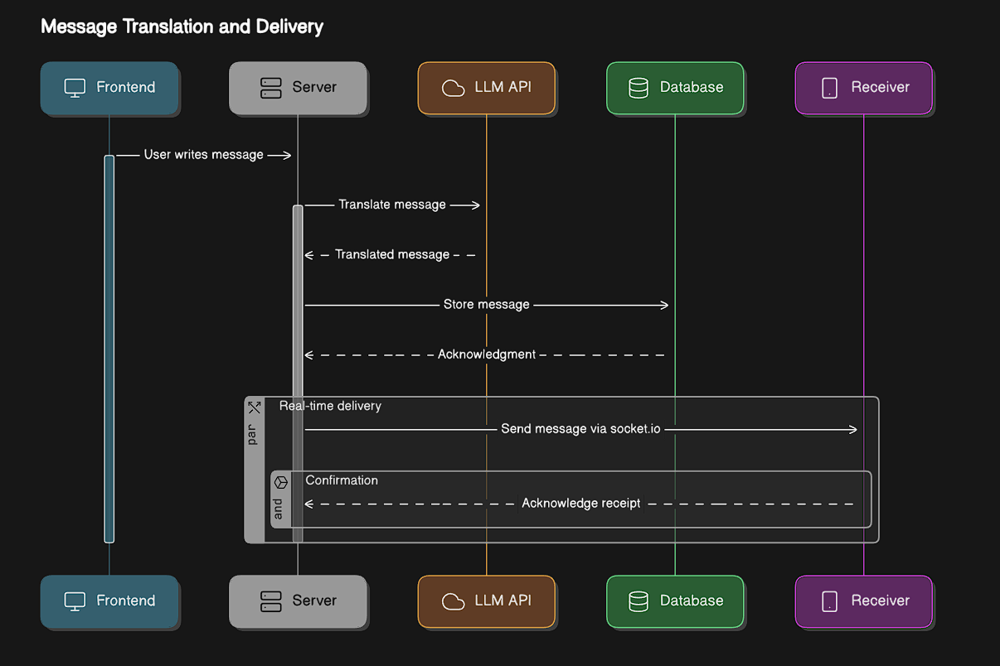

# 🌐 SmartChat: A Real-Time Multilingual Web Chat

SmartChat is a full-stack cloud-based multilingual chat application that bridges language barriers in real-time conversations. It integrates Meta's SeamlessM4T v2 Large model—fine-tuned for low-resource language pairs like Hindi-Tamil—directly into the chat interface to deliver accurate, fast, and context-aware translations.

> ✨ Live Translation • 🔐 Secure Messaging • 🌍 Inclusive Communication

---

## 👥 Team Members

| Name             | Roll Number  |
|------------------|--------------|
| Arpit Nayak      | 22BDS006     |
| Rajput Ajay      | 22BDS049     |
| Vikas Thakur     | 22BDS063     |
| Yash Soni        | 22BDS065     |
| Babad Ganesh     | 22BDS067     |

---

## 💬 About the Chat Application

SmartChat is a modern messaging platform built with:

- **Frontend:** React.js + Socket.IO
- **Backend:** Node.js + Express.js
- **Database:** MongoDB Atlas
- **Media Handling:** Cloudinary
- **Real-time Messaging:** WebSockets via Socket.IO
- **Authentication:** JSON Web Tokens (JWT)
- **Deployment:** AWS EC2 (backend + model), S3 + CloudFront (frontend)

### 🔄 Message Translation Flow

1. User sends a message.
2. If the recipient uses a different language, a **Translate** button appears.
3. On trigger, the backend sends the message to the fine-tuned **SeamlessM4T** API.
4. Translated output is shown in the recipient's preferred language.
5. Messages are stored (both original and translated) in **MongoDB**.

---

## 🧠 LLM Fine-Tuning

We fine-tuned **Meta’s SeamlessM4T v2 Large model** for Hindi-Tamil translation using LoRA (Low-Rank Adaptation).

### 🔍 Fine-Tuning Details

- **Components Tuned**: Last Decoder Block & Language Modelling Head
- **Framework**: PyTorch + HuggingFace + FastAPI
- **BLEU Score**: `41.35` — High accuracy on morphologically rich languages
- **Deployment**: AWS EC2 GPU instance (`g5.2xlarge`) with FastAPI + Uvicorn

---

## 🗂️ Project Folder Structure
Chat Application/ │ ├── backend/ # Backend server (APIs, database handling) ├── frontend/ # Frontend code (UI/UX) │ ├── LLM Fine Tuning/ # LLM related files │ ├── Fine Tuning/ # Scripts and configs for fine-tuning │ └── Testing/ # Scripts for testing and evaluation │ ├── assest/ # Project assets (images, diagrams) │ └── architecture.png # Architecture diagram │ └── README.md # Project documentation
---

## 🏗️ Architecture Overview



This diagram illustrates the seamless integration between the frontend, backend, real-time sockets, and translation API.

---

## 🚀 Getting Started

### 1. Clone the Repository

```bash
git clone https://github.com/Ganeshiiitdwd/SmartChat
cd SmartChat

cd "Chat Application/backend"
npm install
node index.js

cd "../frontend"
npm install
npm run dev


